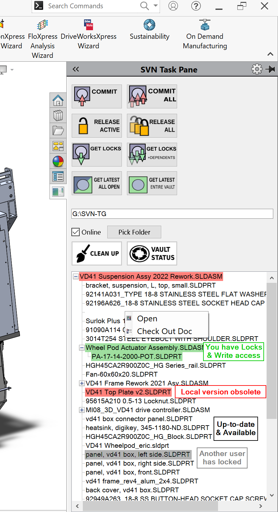

# SW SVN - SVN Integration for SolidWorks
## Disclaimer
This project is not endorsed by, affiliated with, maintained, authorized, or sponsored by SolidWorks or Dassault Systems. All product and company names are the registered trademarks of their original owners. The use of any trade name or trademark is for identification and reference purposes only and does not imply any association with the trademark holder of their product brand.

## Getting Set Up - End User
### What is SVN?
SVN = Subversion. The OG version control system. Written by software developers for collaborating on software development. It is very similar to git, but git by default stores the entire history of the repository (yes even files you think you deleted) locally on every users computer, which is fine for text files that are source code. SVN meanwhile has a central server that stores history and provides some useful collaboration features. The most useful feature for CAD users is the ability to 'lock' out files, which prevents others from editing them at the same time as you and overwriting each other. 

### How this all works
* There's a central server that stores all the CAD files and their history. 
* Everyone "checks out" a local copy of the repository from the server. All local files are 'read-only' by default.
* Want to edit a file? Take the 'lock', which 1) checks with the server that you have the latest version, then 2) tells the server no one else is allowed to get write-access. 
* Finished your changes? "Commit" your changes to the server. You can keep your lock to continue working, or release your lock so the next person can lock & edit it.
* Don't like your changes? You can release your lock and revert your copy to the latest on the server. 

## Getting Set up - Developing The Project

### Integrated Development Enviornment (IDE)
1. Pre-requisite: Windows computer. Not Mac. sorry. 
2. Get visual studio. https://visualstudio.microsoft.com/downloads/
  A. Students from certain universities can get it for free through microsoft azure. https://signup.azure.com/studentverification?offerType=3
  B. Otherwise, you can get the visual studio community package.  https://visualstudio.microsoft.com/downloads/
2. In the Windows app visual studio installer (not the extension), get the ".NET Desktop Developer" workload. 
3. Get the Visual Studio Installer (VSI) add-on package/extension so you can output install files. Note: This is separate/different than the windows app that has the same name. Instructions: https://www.codestack.net/solidworks-api/deployment/installer/vsi/. The instruction videos shows Within Visual studio to go Tools>Extensions>Manage, or just Extensions>Manage on newer versions. Within the popup window, search for "Windows Studio Installer" And select the first one, with an icon of an open cardboard box.  
4. Optional: You may wih to get the github extension at the same time. 
5. Note: In order to build the install file, you will also need tortoiseSVN installed on your local machine. https://tortoisesvn.net/downloads.html That should save the TortoiseSVN executable at "C:\Program Files\TortoiseSVN\bin\TortoiseProc.exe". If not, copy it to that folder. 

### Solidworks
#### Get the API SDK add-in.
1. Add/remove programs > Solidworks > Modify. Go through until you can select products, expand the API checkbox.
2. Navigate to C:\Users\<username>\Documents\SOLIDWORKS Downloads\SOLIDWORKS 2019 SP02\apisdk
3. Run the SolidWorks API SDK.msi file. 

#### Issues & Fixes
##### Visual studio can't find sldworks references
1. In the VS solution explorer, SVN_Vault >(expand the tree)> Reference > click on SolidWorks.Interop.sldworks. The exclamation triangle icon on that item should disappear. 
2. If that didn't work, right click SVN_Vault project, and select "Manage NuGet packages", pick the Browse tab, and search for and install "Microsoft.NETFramework.ReferenceAssemblies"
If it doesn’t ask about templates, then follow this link

##### Missing sdk templates
I'm not sure if this is actaully needed, but 
https://www.codestack.net/solidworks-api/troubleshooting/addins/sdk-installation/
Which says to Save swvbaddin.zip into 
C:\Users\<username>\Documents\Visual Studio 2019\Templates\ProjectTemplates\Visual Basic

http://help.solidworks.com/2019/english/api/sldworksapiprogguide/Overview/SolidWorks_CSharp_and_VB.NET__Project_Templates.htm

##### The referenced component 'Microsoft.VisualBasic' could not be found.
Ignore this error. Things work fine while its there.

##### Unable to delete file "C:\Users\username\source\repos\SW_SVN\SolidWorksSVN\bin\SolidWorksSVN.dll". Access to the path 'C:\...\bin\SolidWorksSVN.dll' is denied.
1. Check if Solidworks is Running, and close it
2. Check if any Solidworks related processes are running in task manager, and force close them
3. Close and re-open visual studio
4. Restart computer

### SVN Server
There's lots of options to set up an SVN Server. I decided to use an amazon web services server.
#### Amazon Web Server
I've created an image, which is not currently available to the public though.

** These instructions are obsolete now. Sorry! **
You'll want to navigate to elastic computing (EC2), and create a new free instance. 
1. Use free-tier ubuntu
2. Make sure you also get elastic storage.
3. You'll have to log into it using putty or another ssh client. Amazon has instructions. You also have to open security rules to accept port 22 and your ip address. 
You'll have to open up any ports you're using for svn as well. 
4. If my amazon web image is available then skip to the next step. The below is how I set up the image.
create new user svnrunner
add sudo privledges
Download and unpack svnedge. I put it in /u1/
https://ctf.open.collab.net/sf/projects/svnedge/
I downloaded it in windows, then sent to server using winscp 
Install and setup java: https://vitux.com/how-to-setup-java_home-path-in-ubuntu/
Follow https://ctf.open.collab.net/sf/wiki/do/viewPage/projects.svnedge/wiki/LinuxInstaller
Set automatic property to needs-lock, on a client PC that’s connected to the repo, and has svn installed do navigate to the repo then: 
svn propset -R svn:auto-props “*.* = svn:needs-lock=yes” .
OR Can also use TortoiseSVN > settings > general > subversion configuration file > edit 
*.* = svn:needs-lock=yes
Only works for new files. To change all existing files, on a client PC that’s connected to the repo, and has svn installed do 
svn propset svn:needs-lock 'yes' -R .
5. Using a web browser, go to the server instance's public ip address (shown on the EC2 dashboard) put a ":" and then the port number. 
The default port for administratoring the vault is 3343 so for example: http://3.15.7.77:3343 if my public ip address was 3.15.7.77
6. To access the vault as a user you'll have to go to that port (default is 18080) then slash "svn". example http://3.15.7.77:18080/svn/

# Running
## Visual Studio
1. Always start visual studio as administrator (start > visual studio > right click > run as administrator) otherwise you can't change the registry to actually open up 
the add-in inside solidworks. 

# Creating an installer
1. Follow https://www.codestack.net/solidworks-api/deployment/installer/vsi/
2. After you right click on the SVN_Vault_installer project and click rebuild, the .msi installer file should show up in C:\Users\<username>\source\repos\SolidWorksVB\SW_SVN\Debug

# Demonstration picture:

Good Luck :) Have Fun :)
